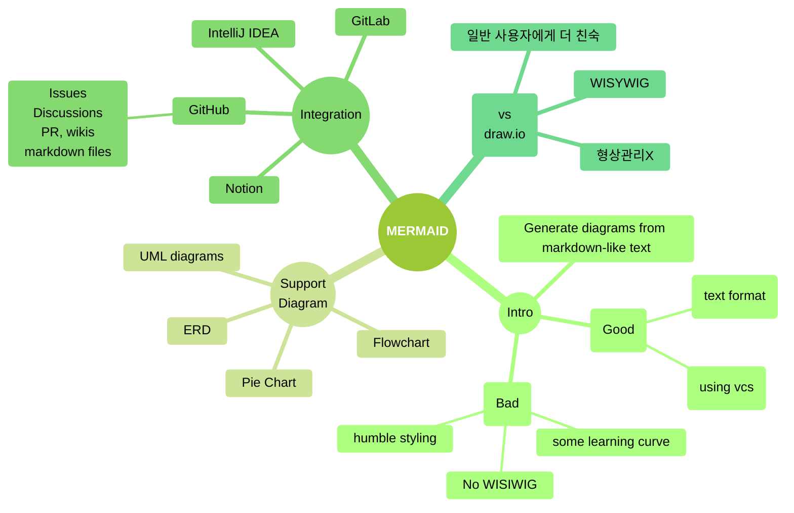

```mermaid
%%{init: {'theme':'forest'}}%% 
mindmap
  root((**MERMAID**))
    A((Intro))
      Generate diagrams from markdown-like text
      (Good)
        (text format)
        (using vcs)
      (Bad)
        No WISIWIG
        some learning curve
        humble styling    
    B((Support<br/>Diagram))
      Flowchart
      UML diagrams
      Pie Chart
      ERD
          
    C((Integration))
      GitHub
        Issues<br/> Discussions<br/> PR, wikis<br/> markdown files
      GitLab
      Notion
      IntelliJ IDEA
    (vs<br/>draw.io)
        WISYWIG
        일반 사용자에게 더 친숙
        형상관리X  
```
